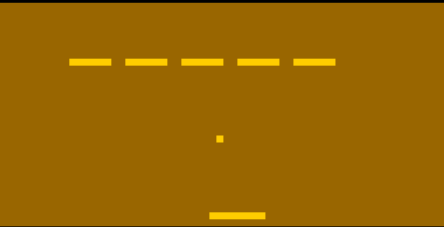

There was no metadata, so I use the command ```steghide extract -sf breakout.jpg```
It gives me one file breakout.ch8. CH8 file is commonly associated with CHIP-8, a simple interpreted programming language used for running retro games and applications. These files typically contain CHIP-8 bytecode that can be executed using a CHIP-8 emulator.
I find out https://johnearnest.github.io/Octo/
Open file and click run:



We have a breakout game, after finishing we get the flag


```WCTF{GAME_OVER_VMASBKLTNUFMGS}```
