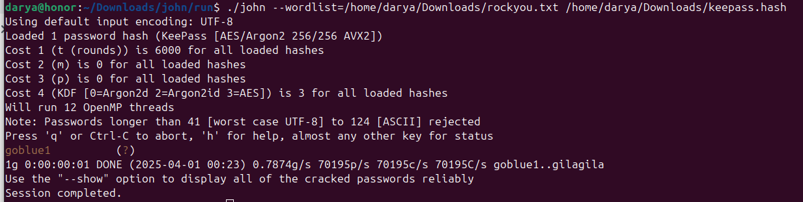
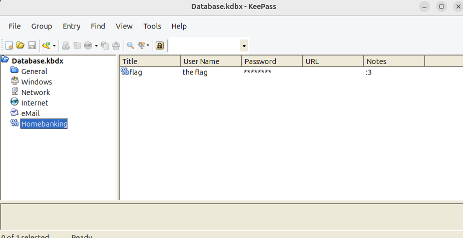

First go to the https://hashes.com/en/johntheripper/keepass2john to get the hash.
We have:

```$keepass$*2*6000*0*5bd85bff1c654df5d8cb8f64b877ea179b66978615917c39faf6edd98444928b*dec1f1a8a46d2257b1c536800ccea618d15523c983162f1a760d0f0e3f32bed6*02dc62f9e295c9a256e4e231b3102c1a*8ed6478291ac58151a98e7465f10a11e8cafc1706d048ef4f94fe51453f091bc*193dd9a5673c4a3f5b33dd59639f27760f03285044f14eacc652f4a441b45413```

Then using these commands download John the Ripper

```sudo apt install -y build-essential libssl-dev
   git clone https://github.com/openwall/john.git
   cd john/src
   ./configure
   make -s clean && make -sj4
```
After installation, go to the run folder inside the john directory and run John the Ripper from there

``` ../run
    ./john --wordlist=/path/to/rockyou.txt /path/to/hash
```
The we get:



Download the KeePass2, open our file and input our password (goblue1)

Then we get:




Flag is: ```wctf{1_th0ught_1t_w4s_s3cur3?}```
