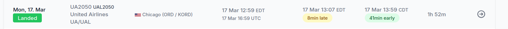

We see the fedex building in the picture on the background. Then I start googling fedex airports in USA with a white building. I find out:


I go to https://www.flightera.net/en/. Choose the airport, data and time I need. I find next:




Flag is: ```wctf{UA2050}```
