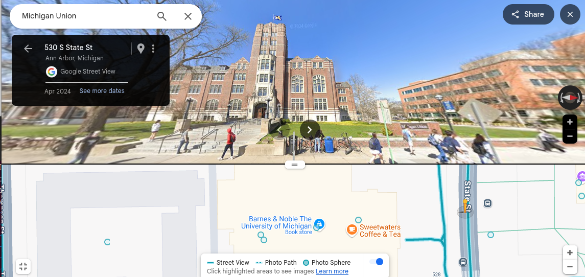

I have no ideas, what flag is that or who it belongs to. So I started googling and discovered that this flag belongs to the University of Michigan. Of course, the uni has many buildings, so I watched the video review (https://www.youtube.com/watch?v=G86yieNIwk4). At 7 minutes, I saw familiar bricks and realized that it is Michigan Union. Go to googlemaps



Obviously, original photo was photographed from the back. I noticed that all coordinates start from 42.27,-83.74. Having a hint (wctf{##.##a,##.##b} where a+b == 4), we can go through three options and get the desired flag. 

```Flag is: wctf{42.271,-83.743}```
